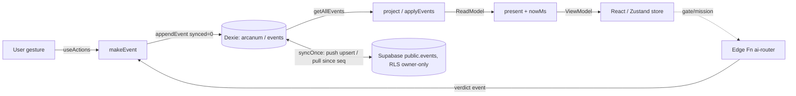

# ARCANUM — Architecture

> The architecture of a personal, event-sourced, local-first learning regime.
> This document describes the system **as the code actually is** (verified against source, with
> `file:line` references). Where reality differs from a naïve mental model, it says so explicitly.

- **Stack:** Next.js 14 (App Router) · TypeScript (strict) · React 18 · Zustand · Dexie (IndexedDB) ·
  Supabase (Postgres + Auth) · Serwist (service worker) · Tailwind · one Deno Edge Function.
- **Shape:** a client-heavy PWA. Nearly all logic runs in the browser; the server surface is thin
  (auth session mint + a few route handlers) and one Edge Function is the AI evaluator.

---

## 1. The guiding principle — event sourcing

**The append-only event log is the single source of truth. Every piece of derived state is a pure
projection of that log, and re-folding the log always yields the same result.**

- An `ArcanumEvent` is an immutable envelope: `{ id, type, ts, device_id, goal_id, module_id, payload, v }`
  (`src/core/event.ts:39-50`). Ids are **UUIDv7** (`newEventId`, `event.ts:283-285`) — time-ordered and
  stable across devices.
- The **total order** over the log is `(ts, then id)` — `compareEvents` (`event.ts:287-296`). This is the
  canonical fold order. It is **not** the Postgres `seq` column (that is only the sync pull-cursor).
- `project(events)` (`src/core/projector.ts:614-621`) is a **pure two-phase fold**: sort by
  `compareEvents`, build a streak timeline over qualified-day ordinals, fold events into an accumulator,
  and assemble a `ReadModel`. No `Date.now()` / `Math.random()` inside the fold — the fold is *atemporal*
  (the current clock is injected later, in `present()`).

### Why event sourcing (and what it buys)

| Property | How the log gives it |
|---|---|
| **Conflict-free multi-device sync** | Two devices each append their own events; sync is a union of immutable rows keyed by `id`. There is no shared mutable state to conflict — order is recomputed from `(ts,id)`. |
| **Retroactive recomputation** | Change a projector rule (a grade threshold, a mastery formula) and *every* past state re-derives correctly from the same log. |
| **Un-corruptible progress** | Progress is never *stored*; it is *derived*. A bad write cannot silently corrupt mastery — the worst case is an extra event. **Precisely:** the *log* is a set (Dexie dedups by primary key on append) and the fold trusts that uniqueness — `project()` itself does **not** dedup, so feeding it the same event id twice would double-count XP. Idempotency lives in the storage layer, not in the fold; never concatenate two event sources without deduping by id first. |
| **Auditability** | Every gate verdict, evaluation, and mission submission is an event in the log with `source: "ai"|"heuristic"` and `provider` — you can always ask *why* a cell is mastered. |

### The load-bearing invariant: `incremental == rebuild`

Re-folding the whole log is O(n). To stay fast, `applyEvents(prev, newEvents, allEvents)`
(`projector.ts:654-676`) takes a **fast path** only when it is provably safe:

```
applyEvents:
  if no prior model / no cursor           → full project(allEvents)      (rebuilt = true)
  else if newEvents are out-of-order       → full project(allEvents)      (rebuilt = true)
        (some e ≤ cursor) OR land on the
        SAME civil day as the cursor
  else (all strictly newer civil days,     → incrementalProject(prev, new) (rebuilt = false)
        in order)
```

The precondition guarantees **no already-closed day's streak/XP can shift**, so the incremental fold
produces byte-identical output to a full rebuild. The whole streak timeline is still recomputed each time
(cheap — it runs over day-ordinals) so streak/shield correctness can never drift (`projector.ts:623-636`).

---

## 2. The event model (23 types)

Read from `src/core/event.ts:11-35` and each payload interface. `goal_id` / `module_id` live in the
envelope; the table shows the `payload`.

| Event type | payload | projects into |
|---|---|---|
| `goal.upserted` | `{title, priority, color, sigil}` | a **Goal** (a spine/world) |
| `path.upserted` | `{path_id, slug, name, description, order?}` | a **PathRM** (a parallel route inside a goal) |
| `module.upserted` | `{title, prereqs, kind, pathId?, concept?, nature?, parts?, sourceObligationId?}` | a **ModuleRM** (a cell); lossless re-upsert preserves progress |
| `roadmap.edge.upserted` | `{from, to}` | a DAG **Edge** (prereq → cell) |
| `node.archived` | `{ref}` | marks a cell/path archived (never deleted) |
| `module.started` / `module.completed` | — | cell `status` transitions |
| `session.started` / `session.ended` | `{kind}` / `{duration_ms, kind?}` | `session.ended` **qualifies a day** (streak, via `isQualifying`); `session.started` is recorded but has no direct read-model projection |
| `error.logged` / `error.resolved` | `{description}` / `{insight}` | the error→insight loop; `error.resolved` qualifies a day + feeds XP; `error.logged` is recorded, not projected |
| `checkpoint.passed` | `{score, kind?, quality?}` | reinforcement (lesson/review), boosts mastery |
| `firetest.attempted` | `{reached, ceiling}` | `firetestRatio` (an offline mastery signal) |
| `note.created` / `note.updated` | `{note_id, title, markdown, moduleId?}` | the **notes graph** (Obsidian-style, content in the log) |
| `sleepcycle.generated` | `{day, digest, context?, ai}` | a **Sleep Cycle** digest (daily fold) |
| `roadmap.node.moved` | `{ref, x, y}` | canvas node position |
| `canvas.synced` | `{fetched_ts, ok, obligations[]}` | **Canvas obligations** snapshot (Fase 4, written by n8n) |
| `grade.celebrated` | `{index}` | `celebratedGrade` — a grade's ceremony fires **once across all devices** |
| `module.evaluated` | `{summary, strengths[], gaps[], challenge, score, source, provider}` | latest advisory **evaluation** per cell (no progression power) |
| `gate.evaluated` | `{passed, score, summary, feedback, source, provider, questions?, queueId?}` | the **exit-gate verdict** — the only thing that sets `gatePassed` |
| `mission.submitted` | `{notes}` | latest **mission evidence** for a heavy cell |
| `ai.queued` | `{queueId, kind, input}` | the honest **pending-AI queue** (offline work, awaiting a real verdict) |

`makeEvent(type, payload, opts)` (`event.ts:308-323`) stamps the envelope; seed events pass a fixed `id`.

### The ReadModel (what the fold produces)

`src/core/read-model.ts:189-221` — one object the whole UI reads:

`goals` · `paths` · `modules` · `edges` · `qualifiedDays` · `stats` (grade/XP/streak/shields) · `reviewDue`
· `notes` · `sleepCycles` · `obligations` · `canvas` · `celebratedGrade` · `evaluations` · `gates` ·
`missions` · `pendingAi` · `cursor {ts, id}`.

The `cursor` is the incremental fold cursor. `present(rm, nowMs)` (`src/core/present.ts:52`) injects the
current clock to derive time-relative view state (is the streak alive *now*, data staleness) — keeping the
fold itself clock-free.

---

## 3. Data flow



The write path is always **gesture → event → log → re-fold → render**. Nothing mutates derived state
directly. Sync is an orthogonal background union of the immutable log with the Supabase mirror.

---

## 4. System layers

Each layer, its responsibility, and its key files.

### 4.1 Event-sourced core — `src/core/`
`event.ts` (envelope + types), `projector.ts` (the fold + `applyEvents`), `read-model.ts` (the shape),
`present.ts` (clock injection), `roadmap.ts` (fog-of-war), `streak.ts` / `mastery.ts` / `grade` in
`config.ts`, `evaluation.ts` (advisory heuristic), `ai-queue.ts` invariant. Pure, deterministic, tested.

### 4.2 Local-first sync — `src/db/`, `src/sync/`, `src/store/`
- **Four separate Dexie databases**, deliberately isolated (the log is *sacred*; the rest is
  reconstructible cache, so a schema change to a cache can never risk the log):
  | DB | tables | purpose |
  |---|---|---|
  | `arcanum` | `events` (pk `id`, idx `synced`,`ts`), `projection`, `sync_meta` | the **event log** (`src/db/schema.ts:23-40`) |
  | `arcanum-books` | `books` (pk `id`), `progress` | downloaded mini-books + reading/listening progress (`book-store.ts`) |
  | `arcanum-exercises` | `banks` (pk `id`) | ingested exercise banks (`exercise-store.ts`) |
  | `arcanum-offline` | `sources` (pk `url`), `spines` (pk `goalId`) | the Spotify-style offline source cache (`offline-store.ts`) |
- **Append**: `appendEvent`/`appendEvents` = Dexie `put`/`bulkPut`, idempotent by `id`, new local events
  `synced=0` (`src/db/repo.ts:11-25`).
- **Sync** (`src/sync/`): `syncOnce` = **push then pull** (`sync.ts:47-51`). Push upserts unsynced rows
  with `onConflict:"id", ignoreDuplicates:true` (a pure append — server rows are immutable to the client,
  `client.ts:33-38`). Pull fetches rows `.gt("seq", cursor)` and appends them `synced=1`, advancing the
  cursor (`sync.ts:28-40`). Backoff + jitter on retry (`sync.ts:61-82`).
- **Hydrate** (`src/store/arcanum-store.ts:88-116`): applies seed events by **set-difference on `id`** —
  only the seed events the local log is *missing*. This lets the seed **evolve** (an existing device gets
  only genuinely-new seed events) without renumbering history or re-uploading already-synced rows.
- **Local-first**: `hydrate` + `seedBooks` + `seedExerciseBanks` run unconditionally on mount
  (`providers.tsx:64-67`). With no Supabase env, `getSupabase()` **throws** (`sync/client.ts:12-15`) and
  every caller guards (`providers.tsx:45-47`, the try/catch in `sync/ai.ts`, `AiQueueDrain.tsx:21-28`), so
  sync/AI are simply off (honest degradation) — the app is fully usable from the local log alone.

### 4.3 Roadmap: paths + fog-of-war — `src/core/roadmap.ts`, `src/lib/spines.ts`
- The roadmap is a **DAG** of cells; `roadmap.edge.upserted` adds prereq edges (cycles rejected,
  `wouldCreateCycle`, `roadmap.ts:82-101`).
- **Fog-of-war is fail-closed**: `isRevealed` (`roadmap.ts:33-48`) — a cell is revealed iff *every live
  prereq is mastered*. `isMastered` (`roadmap.ts:17-25`): a **mission** cell is mastered *only* by passing
  its gate; other cells also by completion or a firetest clearing the bar.
- **Paths** (parallel routes per goal): progress **never crosses a path**. The cross-path exemption in
  `isRevealed` applies only when *both* cells carry a real `pathId`; a `null` on either side keeps gating
  (so a legacy/canvas cell can't be vacuously unsealed — `roadmap.ts:38-46`). `crossPathEcho`
  (`roadmap.ts:58-66`) is context only: it never unseals, never grants XP.

### 4.4 The 3-gate cell + adversarial evaluator
A cell (WHITE ROOM) has three gates: an **entry** blank-challenge, a **body** anchored to a real source,
and an **exit gate** — an adversarial, rubric-anchored interrogation. The exit gate has real power:
`gate.evaluated {passed:true}` is the *only* way `gatePassed` is set. The prompt is **composed** from the
cell's `nature` stance (`NATURE_STANCE`, `src/lib/gate.ts:25-52`):
- `a_mano` → defend the design from first principles (full adversarial gate);
- `delegable` → prove you can *direct and audit* an assistant (comprehension gate);
- `mixto` → sub-parts of each nature, spelled out to the evaluator (`natureRubric`, `gate.ts:55-59`).

Interrogation **calibration** is a second, orthogonal axis (`SpineCell.interrogationMode`): absent =
first-principle (FrED/ITC); `pattern` = ICPC recognition + efficiency (judge: Codeforces); `exam` =
the **strictest gate in the system** (OA Amazon) — FAANG-interview bar demanding all three dimensions
(pattern recognition · clean execution with edge cases · first-principle defence), failure mode named
(`reconocimiento`/`ejecución`/`defensa`), nature-pivoted (Work Simulation is judged as LP judgement,
never as code), time-over-target reported as feedback, never a block. A log-derived **drill signal**
(`reinforceCount`) rides in the assignment so the interrogator weighs mechanical evidence over claims.
The learner's evidence is treated as **data, never instructions** (prompt-injection guard, all modes).
Each cell can also name its real **judge** for the arena HUD (`SpineCell.judge`; the Codeforces line
stays the `pattern` default).

The evaluator is **one Deno Edge Function** `supabase/functions/ai-router/index.ts` (`Deno.serve`,
`:598-658`) with 7 actions (`ocr`, `sleep`, `evaluate`, `tutor`, `lesson`, `gate`, `interrogate`) and a
**multi-provider router**: default chain `["openai","kee"]` (`:15`), `anthropic` implemented but off the
default (reachable only via a request-body override). Models: `gpt-4o` for OCR, `gpt-4o-mini` for all
reasoning/grading. `routeWithFallback` (`src/core/ai-router.ts:11-24`) tries providers in order, first
success wins. Auth: the caller's JWT is passed through and `getUser()` is checked (401 if absent). See
[SECURITY.md](SECURITY.md) for the invariants and the known gaps (no `store:false`, provider override).

### 4.5 The three content layers — `src/lib/learning-modes.ts`, `lesson.ts`
Every cell offers up to three "modes by the time you have": **heavy** (the full directed mission /
adversarial gate — Layer A, the curated spine), **light** (a short on-demand lesson — Layer B, infinite,
generated by the `lesson` action against the cell's real source), and **review** (a 5-minute spaced
question — Layer C, the decay queue). Layers B/C ride on *existing* events (`checkpoint.passed`,
`error.resolved`) and never touch the 0.1% exit gate.

### 4.6 Book reader + ingestion — `src/lib/book.ts`, `cell-slugs.ts`, `book-store.ts`
Mini-books are `.md` **generated externally** and ingested. `parseBook` is the contract (frontmatter +
sectioned body). A book **resolves** to a roadmap cell by its `module_id` handle (`resolveCellId`,
`cell-slugs.ts`): a friendly slug (`itc-c1`, `fred-op-3`) or a raw cell UUID → the cell → shows "Leer";
no match → the book stays **loose** (readable, listed under its spine). Books never *create* cells.
See [CONTENT.md](CONTENT.md).

### 4.7 Exercise engine + sandbox — `src/lib/js-runner.ts`, `py-runner.ts`, `exercises-validate.ts`
- **JS** runs in a fresh **blob Web Worker**, terminated after each run. `WORKER_SHIELD`
  (`js-runner.ts:56-57`) severs `indexedDB, caches, fetch, XMLHttpRequest, WebSocket, importScripts,
  navigator, Notification, openDatabase, localStorage, sessionStorage` **before** any user code executes
  (interpolated at the top of the worker source). A main-thread timeout (3 s) terminates infinite loops.
- **Python** runs via **Pyodide** (CPython in WASM), `CacheFirst`-cached under `arcanum-pyodide` for
  offline; the storage bridge (`indexedDB`/`caches`/…) is severed inside `boot()`.
- **Auto-consistency gate**: importing a bank *executes every code exercise's reference solution against
  its own test cases* before accepting it (`validateBank`, `exercises-validate.ts:44-73`). JS is validated;
  Python is trusted only for the bundled seed (build-time round-trip). See [SECURITY.md](SECURITY.md) for
  the sandbox threat model and its two asymmetries.

### 4.8 Offline — `src/app/sw.ts`, `offline-*.ts`, `src/core/ai-queue.ts`
- **Service worker** (Serwist): precaches the Next build manifest; `/api/*` → `NetworkOnly` (so
  `/api/session` truly fails offline); jsDelivr Pyodide → `CacheFirst`; document navigations →
  `NetworkFirst` on `arcanum-shell` (warmed at `install` — the fix for the iOS "offline reload before
  first nav" hole, `sw.ts:14-20,57-68`).
- **Download for offline** (Spotify model): per-spine source precache with **exact-byte accounting** and
  *no phantom dedup* — a source shared by ≥2 spines counts once; a shared-aware delete frees only exclusive
  bytes (`download-inventory.ts`, `offline-store.ts:82-104`).
- **Pending-AI queue**: offline gate/mission work is `ai.queued` (the user's justification is preserved).
  The queue drains on reconnect to the *real* evaluator; **the gate never opens by enqueuing** — the
  projector's `ai.queued` handler never touches `gatePassed` (tested, `ai-queue.test.ts:14-19`).
- **No reload on reconnect** (`next.config.mjs`): Serwist's injected client defaults to
  `reloadOnOnline: true` — a full `location.reload()` on every `online` event, which killed the
  audiobook mid-listen when the phone auto-joined a WiFi and refreshed background tabs on network
  blips (reproduced live: synthetic `online` → navigation type `"reload"`). It is explicitly set
  **false**: sync and the AI queue have their own gentle `online` listeners; a local-first app never
  needs a reload to start using the network again.
- **Resume where you were** (`src/lib/resume.ts`): the open world / cell sheet / book / library is
  device-local state (never the log). Surfaces write on mount and clear on deliberate close (React
  cleanups don't run on reloads — exactly the wanted semantics), and boot restores the location
  fail-closed (ids validated against the live read-model / book store; a sealed cell restores to its
  honest sealed view). So a tab discard, an OS killing the PWA, or a deploy lands the learner back
  in the open book at the stored fragment — not on the throne hall.

### 4.9 Audio — `src/lib/audio.ts`, `book-speech.ts`, `speech.ts`
- **SFX and per-world ambient music are 100% synthesized** via Web Audio (oscillators + a breathing
  lowpass LFO). **Zero audio asset files** (verified by glob) → zero cost, zero licence, offline by nature.
- **Audiobook**: the Web Speech API reads a book with the device's **installed voices** (offline,
  es-MX first). Preprocessing (`book-speech.ts`) *never reads code literally* — a code block becomes
  "Bloque de código en Python, N líneas"; markdown is stripped; `O(n log n)` → "O de n log n".
  Prose is spoken in **sentence-level fragments** (`splitSpeakable`) — pause/resume is item-granular,
  so pausing loses at most one sentence (never restarts the paragraph/book), and every utterance
  stays under Chrome's silent long-utterance cutoff. The fragment index persists device-local
  (`listenIndex`) and restores across sessions. *Declared limit:* it is a raw item index over the
  fragment list, and announce-mode emits more items than skip-mode, so **flipping `ttsCodeMode` shifts a
  saved position by a few fragments** (clamped, never a crash). It resumes exactly for a fixed code-mode.
- **Background playback**: a Media Session layer (`media-session.ts`) puts real controls on the lock
  screen (play/pause, section skips, ±fragment seeks, per-section metadata + PWA artwork), anchored
  by a **runtime-synthesized silent WAV loop** (`audio-anchor.ts` — zero asset files) that holds the
  OS audio focus. Honest limits: Android/desktop keep speaking with the screen locked; **iOS may
  still cut speechSynthesis on lock** — the player says so instead of pretending.

### 4.10 UI / world themes / layout — `src/lib/subject-themes.ts`, `src/ui/layout-mode.tsx`
Four world themes **derived from the goal title** (not stored): ITC throne-room blue, FrED forge amber,
Competitiva arena red, Alemán cloister green — emitted as CSS custom props onto the subtree. A
**PWA/Desktop** layout toggle (device-local) reflows the app via `<html data-layout>`.

---

## 5. Security & design invariants

These are enforced in code, not by convention. (Details + known gaps: [SECURITY.md](SECURITY.md).)

1. **The exit gate never opens without a real AI verdict.** No provider → `ai.queued` (enqueue-and-wait);
   the local heuristic *never* auto-passes the exit gate (`use-actions.ts:75-86`, `projector.ts:389-408`).
2. **Fog-of-war is fail-closed.** A cell is sealed unless every live prereq is mastered (`roadmap.ts:33-48`).
3. **User code cannot escape the Worker.** `WORKER_SHIELD` severs storage + network globals before user
   code runs (`js-runner.ts:56-75`). *(Asymmetry: Python keeps `fetch` — see SECURITY.md.)*
4. **Reading/listening never grants mastery** — only the gate does. Progress there is device-local session
   state, never the log (`book-store.ts:24-33`).
5. **Progress is independent per path** (`roadmap.ts:38-46`).
6. **Secrets live only in env / Edge-Function secrets**, never in the repo (`.env.local` gitignored;
   verified no key hardcoded).
7. **Content is never invented** — a book/bank either anchors to a real source or is a loose/placeholder
   honest artifact; the reference solution of every code exercise is executed before ingest.

---

## 6. Architecture decisions (ADR-style)

- **Event sourcing over a mutable store.** Conflict-free sync, retroactive recomputation, un-corruptible
  progress, full auditability — at the cost of an O(n) fold, mitigated by the `incremental == rebuild`
  fast path.
- **Local-first (Dexie is truth, Supabase is a mirror).** The app must work walking / at the gym / on a
  plane with no data. Supabase is a backup + cross-device union, not a dependency. Trade-off: no server
  authority — the client is trusted (acceptable for a single-user personal app).
- **Separate Dexie DBs for log / books / exercises / offline-cache.** The log is sacred and append-only;
  the others are reconstructible cache. Isolation means a cache schema bump can never risk the log.
- **Web Speech (device TTS) over a neural TTS API.** Offline, zero cost, zero key, zero data leaving the
  device — the central use-case is passive review with no connectivity. Trade-off: robotic voice, and
  lock-screen/background playback is unreliable (esp. iOS). Chosen deliberately; disclosed honestly.
- **The real judge is external in Competitiva (ICPC).** Arcanum never fakes a code judge; the learner
  brings the real Codeforces/AtCoder verdict, and the gate interrogates the *pattern*. Anti-gaming: an
  "accepted" without explaining the pattern fails.
- **One multi-provider Edge Function, not per-provider endpoints.** A single JWT-gated function with a
  `routeWithFallback` chain (`openai` → `kee`) keeps the client simple and the fallback honest.

---

## 7. Where things live (quick map)

```
src/core/        event-sourced core — events, projector, read-model, present, roadmap, streak, mastery, config
src/db/          Dexie schema + repo (the event log)
src/sync/        Supabase client, push/pull, mapping, auth, ai (Edge Function client)
src/store/       Zustand store + hydrate (seed set-diff)
src/lib/         domain: book/exercise/offline/audio/speech/gate/spines/cell-slugs/learning-modes…
src/ui/          React surfaces (subject map, book reader, exercises, notes, audio, offline panel)
src/app/         Next App Router, providers, service worker (sw.ts), API route handlers
supabase/        migrations (public.events + RLS) · functions/ai-router (the evaluator)
content/         books/ (mini-books .md) · exercises/ (exercise banks .md)  ← the learning content
infra/           canvas-scraper (n8n workflow + docker-compose) — the Fase-4 obligations scraper
scripts/         tooling (loc.mjs, generate-icons.mjs)
```

See also: [README.md](README.md) · [CONTENT.md](CONTENT.md) · [SECURITY.md](SECURITY.md) ·
[OPERATIONS.md](OPERATIONS.md) · [DEPLOY.md](DEPLOY.md) · [AGENT.md](AGENT.md).
